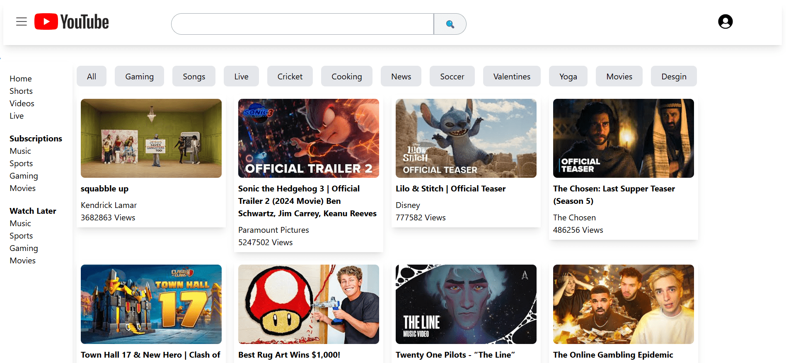
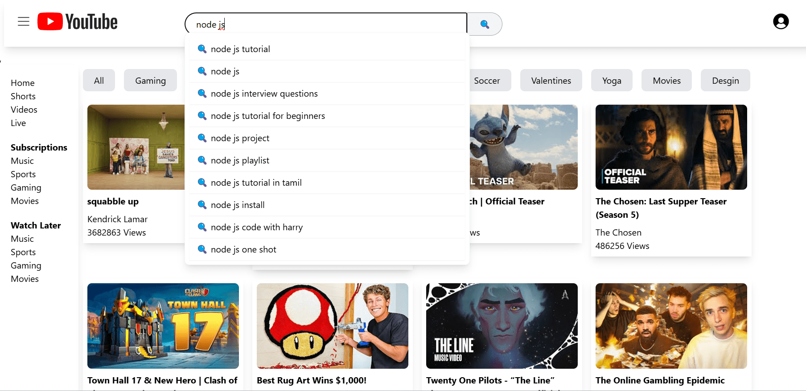
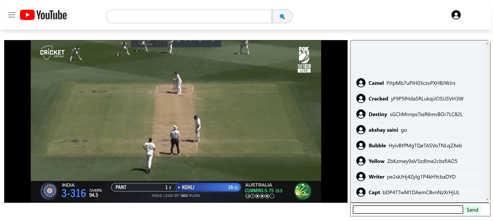

# Video Streaming Platform

A high-performance, feature-rich video streaming platform built with **React.js**, **Tailwind CSS**, and **React-Redux** for state management. This platform allows users to explore videos, interact with comments, and engage in live chats — all while ensuring optimized performance and seamless user experience.

## 🚀 Live Demo

🎥 **Live Video Streaming Platform**: View Live Demo

## Features

- **Optimized Search Bar**:
    - **Debouncing** technique reduces the number of API calls while typing.
    - **Redux Store Caching**: Search results and suggestions are cached in Redux, so repeated searches fetch data from the store instead of making new API calls.
- **N-Level Nested Comments**:
    - Users can post comments and engage in threaded, multi-level conversations on each video.
- **Live Chat**:
    - Real-time chat for viewers to interact during video playback.
    - **API Polling** is used to fetch new messages without interrupting the user experience.
    - A **message limit** (e.g., 100 messages) ensures that the chat remains fast and responsive. Older messages are automatically deleted as new ones arrive.
- **Smooth Video Playback**:
    - Users can browse and play a variety of videos, with smooth scrolling and instant playback.
- **Responsive Design**:
    - Built with **Tailwind CSS** for an adaptive and responsive user interface that works seamlessly across devices.
- **High Performance**:
    - The platform is optimized for long-term use without freezing, even when left open for an entire day.

## Screenshots

## Technologies

- **Frontend**:
    - **React.js**: For building a dynamic, responsive user interface.
    - **Tailwind CSS**: A utility-first CSS framework to design fast and custom UI components.
    - **React-Redux**: For managing the global state of the application (search results, live chat, etc.).
    - **React-Router-Dom**: For easy routing between different pages of the app.
- **Backend**:
    - **Strapi (Headless CMS)**: Manages and serves video and user data via a REST API.
- **Real-Time Communication**:
    - **API Polling**: To fetch new messages in the live chat, without refreshing the page or blocking the main thread.
- **Search Optimization**:
    - **Debouncing** technique to optimize API calls and avoid unnecessary data fetching when the user is typing.

## How It Works

1. **Video Streaming**:
    - Videos are loaded dynamically from the backend (via **Strapi**), and users can browse the homepage for the latest or trending videos.
    - Videos are streamed seamlessly with minimal buffering, providing an excellent user experience.
2. **Search Functionality**:
    - As users type a search query, the **debounced search bar** reduces the number of API requests by waiting for the user to finish typing.
    - Once the search results are returned, they are cached in the **Redux store**. Subsequent searches for the same query fetch data from the store, avoiding unnecessary network calls.
3. **Comment System**:
    - Each video has its own section for comments, supporting multi-level nested replies (N-level comments).
    - Users can interact with the comment threads, with all data being fetched from **Strapi**.
4. **Live Chat**:
    - A real-time **live chat** feature is integrated into the platform.
    - **API Polling** ensures messages are fetched periodically, providing a smooth chat experience without page refreshes.
    - To prevent the chat from getting too cluttered, the app automatically deletes older messages (based on a limit, e.g., 100 messages).

## Performance Optimizations

- **Search Optimization**:
    - The use of **debouncing** minimizes unnecessary API calls while the user types, providing a smoother, more responsive search experience.
    - **Redux Store Caching** ensures that previously fetched search results are reused when the user searches again, reducing API load.
- **Live Chat Efficiency**:
    - By setting a **message limit** and implementing **API polling**, the app can handle real-time messages efficiently without causing performance issues.
    - Older chat messages are automatically removed when the chat reaches its limit, keeping the interface clean and fast.
- **Lightweight & Fast**:
    - **Tailwind CSS** helps in creating a lightweight and fast-loading app.
    - The app is optimized to handle long periods of use without freezing, even when the tab is kept open for a full day.

---

